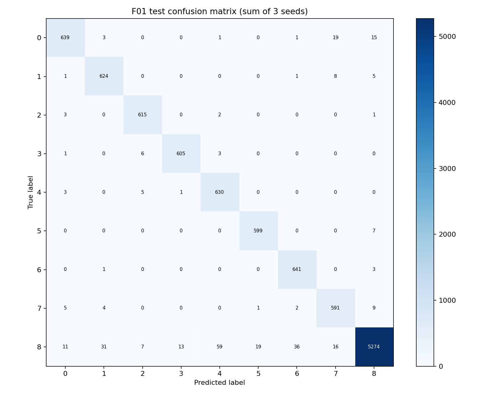

# DeepWeeds Lab Day 2 Report

Student: Nguyen Hong Cuong  
ID: 2A202602415  
Fold: official fold 0

## 1. Setup and reproducibility

The experiment used all 17,509 DeepWeeds RGB images and the unchanged official
fold-0 CSV files: 10,501 training, 3,501 validation, and 3,507 test images.
Pairwise filename intersections are empty, the union contains 17,509 files,
and every CSV filename exists in `images/`. Validation macro-F1 selected each
checkpoint; test predictions were exported only for the locked final and
baseline configurations.

Runs were executed in Google Colab on an NVIDIA T4 with Python 3.13.15,
PyTorch 2.11.0+cu130, and timm 1.0.29. Both configurations used 224-pixel
inputs, ImageNet initialization, AdamW, backbone LR 1e-4, head LR 1e-3,
weight decay 0.05, one warmup epoch, cosine decay, AMP, and 10 epochs.

## 2. Configurations and GPU budget

The available T4 session was used for the six required final/baseline runs.
The broader six-backbone and eleven-ablation campaign was reduced to fit the
session budget; no unrun experiment is presented as measured evidence.

| ID | Backbone and recipe | Seeds | Mean seconds/epoch | Params | Conv/linear GMAC |
|---|---|---|---:|---:|---:|
| T00 | ResNet-50, basic augmentation, CE, no mixing, no EMA | 0, 1, 2 | 45.54 | 23.526 M | 4.087 |
| F01 | ConvNeXt-Tiny, RandAugment, weighted CE, CutMix, EMA | 0, 1, 2 | 57.96 | 27.827 M | 4.455 |

F01 used effective-number class weights (`beta=0.9999`), CutMix alpha 1.0,
EMA decay 0.999, and batch size 48. T00 used batch size 64. The complete
configuration, split statistics, and epoch histories are under
`experiment_logs/`.

## 3. Validation selection

| ID | Seed | Best epoch | Validation macro-F1 | Validation top-1 |
|---|---:|---:|---:|---:|
| T00 | 0 | 10 | 0.7945 | 0.8520 |
| T00 | 1 | 8 | 0.8061 | 0.8586 |
| T00 | 2 | 9 | 0.7938 | 0.8500 |
| F01 | 0 | 10 | 0.9658 | 0.9729 |
| F01 | 1 | 10 | 0.9613 | 0.9677 |
| F01 | 2 | 10 | 0.9649 | 0.9726 |

F01 was locked because its mean validation macro-F1 was 0.9640, compared with
0.7981 for T00. The validation advantage of about 0.166 is much larger than
the observed three-seed variation. The six learning-curve figures in `curves/`
show the measured loss, top-1, and macro-F1 trajectories.

## 4. Final test results

| ID | Test macro-F1 | Test top-1 | Balanced accuracy | ECE | NLL |
|---|---:|---:|---:|---:|---:|
| T00 | 0.7988 +/- 0.0093 | 0.8530 +/- 0.0072 | 0.7607 +/- 0.0147 | 0.0260 +/- 0.0033 | 0.4366 +/- 0.0181 |
| F01 | **0.9655 +/- 0.0032** | **0.9712 +/- 0.0027** | **0.9769 +/- 0.0019** | **0.0243 +/- 0.0002** | **0.1161 +/- 0.0052** |

Values are mean +/- population standard deviation across seeds 0, 1, and 2.
F01 improves test macro-F1 by 0.1667 and top-1 by 0.1182. Its validation/test
macro-F1 gap is 0.0015, which gives no sign of selection leakage. Metrics are
recomputed from the committed probability CSV files by `eval.py`.

## 5. Per-class analysis

| Class | T00 recall | T00 F1 | F01 recall | F01 F1 |
|---|---:|---:|---:|---:|
| Chinee apple | 0.4676 | 0.6193 | 0.9425 | 0.9530 |
| Lantana | 0.8106 | 0.8415 | 0.9765 | 0.9586 |
| Parkinsonia | 0.9340 | 0.9113 | 0.9903 | 0.9809 |
| Parthenium | 0.6374 | 0.7520 | 0.9837 | 0.9806 |
| Prickly acacia | 0.7465 | 0.7627 | 0.9859 | 0.9446 |
| Rubber vine | 0.7426 | 0.8203 | 0.9884 | 0.9780 |
| Siam weed | 0.8558 | 0.8666 | 0.9938 | 0.9669 |
| Snake weed | 0.6879 | 0.7128 | 0.9657 | 0.9486 |
| Negative | 0.9636 | 0.9026 | 0.9649 | 0.9785 |

The largest gains occur on the difficult Chinee apple and Snake weed classes.
Across the three summed F01 confusion matrices, the largest off-diagonal count
is Negative -> Prickly acacia (59 of 5,466 decisions), followed by Negative ->
Siam weed (36) and Negative -> Lantana (31). Chinee apple -> Snake weed occurs
19 times. These are observations from predictions; visual similarity and the
large Negative class are plausible causes but were not separately tested.



## 6. Inference and limitations

All committed metrics use I00: one center-crop view with probability export.
Batch-1 latency, TTA, temperature scaling, ensemble, and Conv-BN/FP16 inference
benchmarks were not run, so the report does not claim their effects. ECE is the
uncalibrated value from the exported probabilities.

The official fold is random rather than location based, so results may be
optimistic for new farms or seasons. The reduced session budget compares the
locked F01 directly with T00 but does not support isolated causal claims for
each F01 component. The GMAC counter counts Conv and Linear operations and is
an estimate rather than measured deployment latency.

## 7. Submitted evidence

- `predictions/`: 12 CSV files, 3,501 validation or 3,507 test rows each.
- `curves/`: six training curves and the summed F01 confusion matrix.
- `experiment_logs/`: config, history, split statistics, and summary per run.
- `eval_out/`: per-seed, aggregate, per-class, confusion, and rubric outputs.
- `results.xlsx`: populated workbook generated from those committed files.
- Executed Colab: https://colab.research.google.com/drive/1sotmWRH3K7R8zslqD0iRLoUPFz2ej1oY

## 8. Verification commands

```bash
python eval.py score --pred "submissions/2A202602415_nguyen_hong_cuong/predictions/F01_seed*_test.csv" --test-csv data/labels/test_subset0.csv --labels data/labels/labels.csv --tag F01 --out submissions/2A202602415_nguyen_hong_cuong/eval_out
python eval.py grade --final "submissions/2A202602415_nguyen_hong_cuong/predictions/F01_seed*_test.csv" --baseline "submissions/2A202602415_nguyen_hong_cuong/predictions/T00_seed*_test.csv" --final-val "submissions/2A202602415_nguyen_hong_cuong/predictions/F01_seed*_val.csv" --test-csv data/labels/test_subset0.csv --val-csv data/labels/val_subset0.csv --labels data/labels/labels.csv
```
